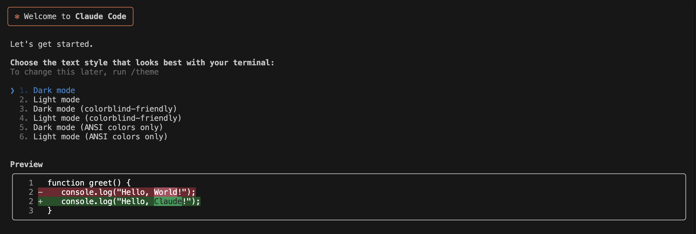
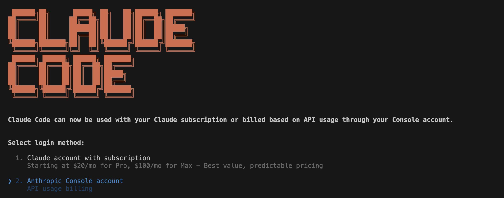
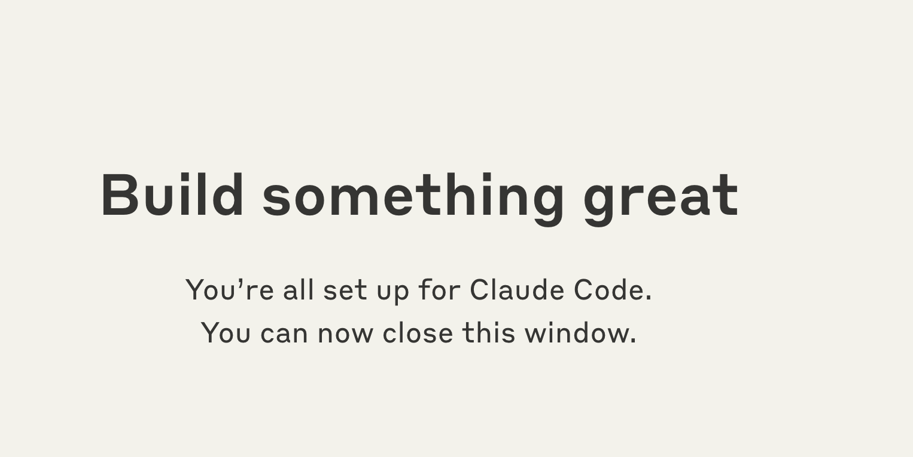
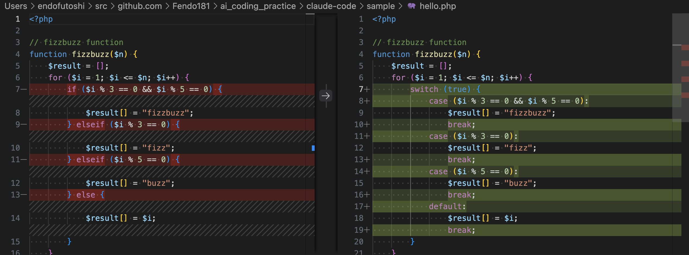

#　 手を動かしながらClaude Codeを使って見る。

## はじめに

ClaudeCodeを使うにあたって、自分用にセットアップ方法をまとめます。
注意として、この記事は`2025/06/17`時点の情報を参考にして執筆しています。
ここに書いている内容がアップデートされている可能性がある為、公式の最新の記事を参考にしてください。

実行環境について以下に乗せておきます。

| 項目 | 内容 |
| ---- | ---- |
| OS | macOS Sonoma 14.5 |
| node | v22.2.0 |
| npm | 10.7.0 |


## Claude Codeとは

>Claude Codeは、ターミナル上で動作し、コードベースを理解し、自然言語コマンドを通じてより速くコーディングできるようサポートするエージェント型コーディングツールです。開発環境に直接統合することで、追加のサーバーや複雑なセットアップを必要とせずにワークフローを効率化します
ref: [Claude Code](https://claude.ai/claude-code)

特徴としては以下があげられます。

- **コード生成**: 自然言語の指示からコードを生成する能力があります。例えば、特定の機能を実装するためのコードを自動的に生成できます。
- **コードの理解**: 既存のコードを解析し、コメントやドキュメントを生成することができます。これにより、コードの可読性と保守性が向上します。
- **デバッグ支援**: コードのバグを検出し、修正案を提案することができます。これにより、開発者は迅速に問題を解決できます。


## 初期セットアップについて

作業用フォルダを作成します。

```bash
mkdir claude-code
cd claude-code
```

以下のコマンドを実行して、`claude-code`をインストールします。

```bash
npm install -g @anthropic-ai/claude-code
```

※`-g`オプションをつけることで、グローバルにインストールされます。

以下のコマンドを実行して正常にインストールされたことを確認します。

```bash
claude-code --version #1.0.25 (Claude Code)
```

次に `claude`を実行してREPL（対話型の実行環境）形式でセットアップを行います。

```bash
claude
```
ここでは`Dark Mode`を選択します。



次にプランの選択をします。定額のサブスクリプションか、従量課金をここで選択します。
今回はサブスクリプションのProを使うので、「1. Claude account with subscription」を選びます。



クリックすると、連携画面に遷移するので、そこでAnthropicのアカウントを連携します。



連携が完了すると、以下のような画面が表示されます。

```bash
ttps://claude.ai/oauth/authorize?code=true&***

 Logged in as hogefuga.com
```

Enterを押すと、以下のような画面が表示されます。

```bash
│ ✻ Welcome to Claude Code │
╰──────────────────────────╯

 Security notes:

 1. Claude can make mistakes
    You should always review Claude's responses, especially when
    running code.

 2. Due to prompt injection risks, only use it with code you trust
    For more details see:
    https://docs.anthropic.com/s/claude-code-security

 Press Enter to continue…


(日本語訳)
- 1. Claudeは間違いを犯す可能性があります。
  - Claudeの応答は常に確認する必要があります。特にコードを実行する場合は注意が必要です。
- 2. プロンプトインジェクションのリスクのため、信頼できるコードでのみ使用してください。
  - 詳細については、[Claude Code Security](https://docs.anthropic.com/s/claude-code-security)を参照してください。

```

ENTERを押すと、次にターミナル設定について聞かれます。

```bash
 Use Claude Code's terminal setup?

 For the optimal coding experience, enable the recommended settings
 for your terminal: Shift+Enter for newlines

 ❯ 1. Yes, use recommended settings
   2. No, maybe later with /terminal-setup

 Enter to confirm · Esc to skip
```

ここでは、`1. Yes, use recommended settings`を選択します。

次にフォルダへアクセスしても良いかを聞かれます。

```bash
 Claude Code needs access to your current directory to read and write files.
 Do you want to proceed?

 ❯ 1. Yes, proceed
   1. No, cancel

 Enter to confirm · Esc to skip
```

これも`Yes, proceed`を選択します。
実行後に`VS Code`の拡張機能をインストール済みであれば、インストールされた事が表示されます。

```bash
│ 🎉 Claude Code extension installed in VS Code!               │
│ Version: 1.0.25                                              │
│                                                              │
│ Quick start:                                                 │
│ • Press Cmd+Esc to launch Claude Code                        │
│ • View and apply file diffs directly in your editor          │
│ • Use Cmd+Option+K to insert @File references                │
│                                                              │
│ For more information, see                                    │
│ https://docs.anthropic.com/s/claude-code-ide-integrations    │
│                                                           
```


ここまでで、基本的なセットアップは完了です
お疲れ様でした。

## 基本操作

これ以降は `claude` コマンドを実行することで、REPL形式で操作が可能です。

```bash

╭──────────────────────────────────────────────────────────────╮
│ >                                                            │
╰──────────────────────────────────────────────────────────────╯
  ? for shortcuts                                            ◯
```

#### PHPのFizzBuzzをリファクタリングを試す。

サンプルコードで以下にPHPでFizzBuzzのコードがあります。
`if`、`else`文で書かれていますが、これを**`case`文でリファクタリングしてもらいます。

```php
<?php

// fizzbuzz function
function fizzbuzz($n) {
    $result = [];
    for ($i = 1; $i <= $n; $i++) {
        if ($i % 3 == 0 && $i % 5 == 0) {
            $result[] = "fizzbuzz";
        } elseif ($i % 3 == 0) {
            $result[] = "fizz";
        } elseif ($i % 5 == 0) {
            $result[] = "buzz";
        } else {
            $result[] = $i;
        }
    }
    return implode(", ", $result);
}

// Example usage
echo fizzbuzz(15); // Output: 1, 2, fizz, 4, buzz, fizz, 7, 8, fizz, buzz, 11, fizz, 13, 14, fizzbuz
```

上記で例えば以下のように`claude`に依頼を出します。

```bash
ファイルを解析してcase文でリファクタリングしてください。
```
すると、以下のようにリファクタリングされたコードが返ってきます。
この変更を受け入れる場合は、右上のチェックボタンを押します





こんな感じでclaudeに依頼を出すことで、CLI上でコードのリファクタリングや修正を行うことができます。

## モードの切り替え

Claude Codeには、いくつかのモードが用意されています。
モードを切り替えることで、特定のタスクに最適化された動作をさせることができます。
モードの切り替えは、以下のコマンドで行います。

- `shift + tab`(1回目): `auto-accept edits on`が有効になる
  - コードの変更を自動的に受け入れるモードで、デフォルトに加えてファイルの作成や変更等が許可されている状態となります。
- `shift + tab`(2回目): `plan mode on`が有効になる
  - このモードでは、コードの変更を提案する前に、ファイルの作成や変更前に事前に計画を考えてくれるモードです。


実際に`plan mode on`で以下のような命令を行った際の結果をみてみます。

```bash
fizz buzzの部分で共通化できる箇所は定数に置き換えてください
```

claude codeのレスポンス

```bash
 Ready to code?                                               │
│                                                              │
│ Here is Claude's plan:                                       │
│ ╭──────────────────────────────────────────────────────────╮ │
│ │ FizzBuzz定数化リファクタリング計画                       │ │
│ │                                                          │ │
│ │ 現在のコードで定数化できる部分：                         │ │
│ │                                                          │ │
│ │ 1. 数値の定数化                                          │ │
│ │   - 3 → FIZZ_DIVISOR                                     │ │
│ │   - 5 → BUZZ_DIVISOR                                     │ │
│ │   - 15 → FIZZBUZZ_DIVISOR (3と5の最小公倍数)             │ │
│ │ 2. 文字列の定数化                                        │ │
│ │   - "fizz" → FIZZ_TEXT                                   │ │
│ │   - "buzz" → BUZZ_TEXT                                   │ │
│ │   - "fizzbuzz" → FIZZBUZZ_TEXT                           │ │
│ │ 3. 区切り文字の定数化                                    │ │
│ │   - ", " → DELIMITER                                     │ │
│ │                                                          │ │
│ │ 変更内容：                                               │ │
│ │ - ファイル上部に定数定義を追加                           │ │
│ │ - switch文の条件とテキストを定数に置き換え               │ │
│ │ - implode関数の区切り文字を定数に置き換え                │ │
│ ╰──────────────────────────────────────────────────────────╯ │
│                                                              │
│ Would you like to proceed?                                   │
│                                                              │
│ ❯ 1. Yes                                                     │
│   2. No, keep planning                                       │
│                                                              │
```


こんな感じで提案してくれるので、「Yes」を選択するとコードが以下のように変更されました。

```php
<?php

// FizzBuzz constants
const FIZZ_DIVISOR = 3;
const BUZZ_DIVISOR = 5;
const FIZZBUZZ_DIVISOR = 15;
const FIZZ_TEXT = "fizz";
const BUZZ_TEXT = "buzz";
const FIZZBUZZ_TEXT = "fizzbuzz";
const DELIMITER = ", ";

// fizzbuzz function
function fizzbuzz($n) {
    $result = [];
    for ($i = 1; $i <= $n; $i++) {
        switch (true) {
            case ($i % FIZZBUZZ_DIVISOR == 0):
                $result[] = FIZZBUZZ_TEXT;
                break;
            case ($i % FIZZ_DIVISOR == 0):
                $result[] = FIZZ_TEXT;
                break;
            case ($i % BUZZ_DIVISOR == 0):
                $result[] = BUZZ_TEXT;
                break;
            default:
                $result[] = $i;
                break;
        }
    }
    return implode(DELIMITER, $result);
}

// Example usage
echo fizzbuzz(15); // Output: 1, 2, fizz, 4, buzz, fizz, 7, 8, fizz, buzz, 11, fizz, 13, 14, fizzbuzz
```

このように、`plan mode on`を使うことで、コードの変更内容を事前に確認することができるので、安心してコードの変更を行うことができますし、意図しない変更を防ぐことができます。

## ClaudeCodeの独自ルールを用意する。

Claude Codeでは、独自のルールを設定することができます。
これにより、特定のプロジェクトやチームのコーディングスタイルに合わせたコード生成やリファクタリングが可能になります。
これは `Manage Claude's memory`という機能を使います。

現時点で設定ができるファイルは3つあります。


ref: https://docs.anthropic.com/en/docs/claude-code/memory

