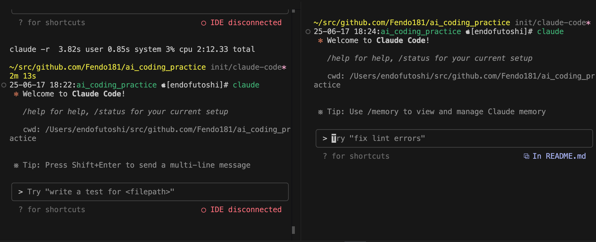

#　 手を動かしながらClaude Codeを使って見る。

## はじめに

ClaudeCodeを使うにあたって、自分用にセットアップ方法をまとめます。
注意として、この記事は`2025/06/17`時点の情報を参考にして執筆しています。
ここに書いている内容がアップデートされている可能性がある為、公式の最新の記事を参考にしてください。

実行環境について以下に乗せておきます。

| 項目 | 内容 |
| ---- | ---- |
| OS | macOS Sonoma 14.5 |
| node | v22.2.0 |
| npm | 10.7.0 |


## Claude Codeとは

>Claude Codeは、ターミナル上で動作し、コードベースを理解し、自然言語コマンドを通じてより速くコーディングできるようサポートするエージェント型コーディングツールです。開発環境に直接統合することで、追加のサーバーや複雑なセットアップを必要とせずにワークフローを効率化します
ref: [Claude Code](https://claude.ai/claude-code)

特徴としては以下があげられます。

- **コード生成**: 自然言語の指示からコードを生成する能力があります。例えば、特定の機能を実装するためのコードを自動的に生成できます。
- **コードの理解**: 既存のコードを解析し、コメントやドキュメントを生成することができます。これにより、コードの可読性と保守性が向上します。
- **デバッグ支援**: コードのバグを検出し、修正案を提案することができます。これにより、開発者は迅速に問題を解決できます。


## 初期セットアップについて

作業用フォルダを作成します。

```bash
mkdir claude-code
cd claude-code
```

以下のコマンドを実行して、`claude-code`をインストールします。

```bash
npm install -g @anthropic-ai/claude-code
```

※`-g`オプションをつけることで、グローバルにインストールされます。

以下のコマンドを実行して正常にインストールされたことを確認します。

```bash
claude-code --version #1.0.25 (Claude Code)
```

次に `claude`を実行してREPL（対話型の実行環境）形式でセットアップを行います。

```bash
claude
```
ここでは`Dark Mode`を選択します。


次にプランの選択をします。定額のサブスクリプションか、従量課金をここで選択します。
今回はサブスクリプションのProを使うので、「1. Claude account with subscription」を選びます。


クリックすると、連携画面に遷移するので、そこでAnthropicのアカウントを連携します。


連携が完了すると、以下のような画面が表示されます。

```bash
ttps://claude.ai/oauth/authorize?code=true&***

 Logged in as hogefuga.com
```

Enterを押すと、以下のような画面が表示されます。

```bash
│ ✻ Welcome to Claude Code │
╰──────────────────────────╯

 Security notes:

 1. Claude can make mistakes
    You should always review Claude's responses, especially when
    running code.

 2. Due to prompt injection risks, only use it with code you trust
    For more details see:
    https://docs.anthropic.com/s/claude-code-security

 Press Enter to continue…


(日本語訳)
- 1. Claudeは間違いを犯す可能性があります。
  - Claudeの応答は常に確認する必要があります。特にコードを実行する場合は注意が必要です。
- 2. プロンプトインジェクションのリスクのため、信頼できるコードでのみ使用してください。
  - 詳細については、[Claude Code Security](https://docs.anthropic.com/s/claude-code-security)を参照してください。

```

ENTERを押すと、次にターミナル設定について聞かれます。

```bash
 Use Claude Code's terminal setup?

 For the optimal coding experience, enable the recommended settings
 for your terminal: Shift+Enter for newlines

 ❯ 1. Yes, use recommended settings
   2. No, maybe later with /terminal-setup

 Enter to confirm · Esc to skip
```

ここでは、`1. Yes, use recommended settings`を選択します。

次にフォルダへアクセスしても良いかを聞かれます。

```bash
 Claude Code needs access to your current directory to read and write files.
 Do you want to proceed?

 ❯ 1. Yes, proceed
   1. No, cancel

 Enter to confirm · Esc to skip
```

これも`Yes, proceed`を選択します。
実行後に`VS Code`の拡張機能をインストール済みであれば、インストールされた事が表示されます。

```bash
│ 🎉 Claude Code extension installed in VS Code!               │
│ Version: 1.0.25                                              │
│                                                              │
│ Quick start:                                                 │
│ • Press Cmd+Esc to launch Claude Code                        │
│ • View and apply file diffs directly in your editor          │
│ • Use Cmd+Option+K to insert @File references                │
│                                                              │
│ For more information, see                                    │
│ https://docs.anthropic.com/s/claude-code-ide-integrations    │
│                                                           
```


ここまでで、基本的なセットアップは完了です
お疲れ様でした。

## 基本操作

これ以降は `claude` コマンドを実行することで、REPL形式で操作が可能です。

```bash

╭──────────────────────────────────────────────────────────────╮
│ >                                                            │
╰──────────────────────────────────────────────────────────────╯
  ? for shortcuts                                            ◯
```

#### PHPのFizzBuzzをリファクタリングを試す。

サンプルコードで以下にPHPでFizzBuzzのコードがあります。
`if`、`else`文で書かれていますが、これを**`case`文でリファクタリングしてもらいます。

```php
<?php

// fizzbuzz function
function fizzbuzz($n) {
    $result = [];
    for ($i = 1; $i <= $n; $i++) {
        if ($i % 3 == 0 && $i % 5 == 0) {
            $result[] = "fizzbuzz";
        } elseif ($i % 3 == 0) {
            $result[] = "fizz";
        } elseif ($i % 5 == 0) {
            $result[] = "buzz";
        } else {
            $result[] = $i;
        }
    }
    return implode(", ", $result);
}

// Example usage
echo fizzbuzz(15); // Output: 1, 2, fizz, 4, buzz, fizz, 7, 8, fizz, buzz, 11, fizz, 13, 14, fizzbuz
```

上記で例えば以下のように`claude`に依頼を出します。

```bash
ファイルを解析してcase文でリファクタリングしてください。
```
すると、以下のようにリファクタリングされたコードが返ってきます。
この変更を受け入れる場合は、右上のチェックボタンを押します


こんな感じでclaudeに依頼を出すことで、CLI上でコードのリファクタリングや修正を行うことができます。

## モードの切り替え

Claude Codeには、いくつかのモードが用意されています。
モードを切り替えることで、特定のタスクに最適化された動作をさせることができます。
モードの切り替えは、以下のコマンドで行います。

- `shift + tab`(1回目): `auto-accept edits on`が有効になる
  - コードの変更を自動的に受け入れるモードで、デフォルトに加えてファイルの作成や変更等が許可されている状態となります。
- `shift + tab`(2回目): `plan mode on`が有効になる
  - このモードでは、コードの変更を提案する前に、ファイルの作成や変更前に事前に計画を考えてくれるモードです。


実際に`plan mode on`で以下のような命令を行った際の結果をみてみます。

```bash
fizz buzzの部分で共通化できる箇所は定数に置き換えてください
```

claude codeのレスポンス

```bash
 Ready to code?                                               │
│                                                              │
│ Here is Claude's plan:                                       │
│ ╭──────────────────────────────────────────────────────────╮ │
│ │ FizzBuzz定数化リファクタリング計画                       │ │
│ │                                                          │ │
│ │ 現在のコードで定数化できる部分：                         │ │
│ │                                                          │ │
│ │ 1. 数値の定数化                                          │ │
│ │   - 3 → FIZZ_DIVISOR                                     │ │
│ │   - 5 → BUZZ_DIVISOR                                     │ │
│ │   - 15 → FIZZBUZZ_DIVISOR (3と5の最小公倍数)             │ │
│ │ 2. 文字列の定数化                                        │ │
│ │   - "fizz" → FIZZ_TEXT                                   │ │
│ │   - "buzz" → BUZZ_TEXT                                   │ │
│ │   - "fizzbuzz" → FIZZBUZZ_TEXT                           │ │
│ │ 3. 区切り文字の定数化                                    │ │
│ │   - ", " → DELIMITER                                     │ │
│ │                                                          │ │
│ │ 変更内容：                                               │ │
│ │ - ファイル上部に定数定義を追加                           │ │
│ │ - switch文の条件とテキストを定数に置き換え               │ │
│ │ - implode関数の区切り文字を定数に置き換え                │ │
│ ╰──────────────────────────────────────────────────────────╯ │
│                                                              │
│ Would you like to proceed?                                   │
│                                                              │
│ ❯ 1. Yes                                                     │
│   2. No, keep planning                                       │
│                                                              │
```

こんな感じで提案してくれるので、「Yes」を選択するとコードが以下のように変更されました。

```php
<?php

// FizzBuzz constants
const FIZZ_DIVISOR = 3;
const BUZZ_DIVISOR = 5;
const FIZZBUZZ_DIVISOR = 15;
const FIZZ_TEXT = "fizz";
const BUZZ_TEXT = "buzz";
const FIZZBUZZ_TEXT = "fizzbuzz";
const DELIMITER = ", ";

// fizzbuzz function
function fizzbuzz($n) {
    $result = [];
    for ($i = 1; $i <= $n; $i++) {
        switch (true) {
            case ($i % FIZZBUZZ_DIVISOR == 0):
                $result[] = FIZZBUZZ_TEXT;
                break;
            case ($i % FIZZ_DIVISOR == 0):
                $result[] = FIZZ_TEXT;
                break;
            case ($i % BUZZ_DIVISOR == 0):
                $result[] = BUZZ_TEXT;
                break;
            default:
                $result[] = $i;
                break;
        }
    }
    return implode(DELIMITER, $result);
}

// Example usage
echo fizzbuzz(15); // Output: 1, 2, fizz, 4, buzz, fizz, 7, 8, fizz, buzz, 11, fizz, 13, 14, fizzbuzz
```

このように、`plan mode on`を使うことで、コードの変更内容を事前に確認することができるので、安心してコードの変更を行うことができますし、意図しない変更を防ぐことができます。

## ClaudeCodeの独自ルールを用意する。

Claude Codeでは、独自のルールを設定することができます。
これにより、特定のプロジェクトやチームのコーディングスタイルに合わせたコード生成やリファクタリングが可能になります。
これは `Manage Claude's memory`という機能を使います。

現時点で設定ができるファイルは3つあります。

| Memory Type | Location | Purpose | Use Case Examples |
|--------------|----------|---------|--------------------|
| Project Memory | `./CLAUDE.md` | プロジェクト固有の設定 | プロジェクトのコーディングスタイルやルールを定義する |
| User Memory  | `~/.claude/CLAUDE.md` | すべてのプロジェクトに対する個人的な設定 | コードスタイルの設定、個人用ツールのショートカット |
| Project memory (local) | `./CLAUDE.local.md` | 個人のプロジェクト固有の設定 | （非推奨、下記参照）サンドボックスURL、推奨テストデータ |

ref: https://docs.anthropic.com/en/docs/claude-code/memory

これらの設定は`/init`コマンドを実行することで、設定ファイルを生成することができます。  
すでに編集されているファイルがあれば、ファイルを読み込んで`CLAUDE.md`を生成します。

```bash
# AI Coding Practice - Claude Configuration

## Project Overview

This is a learning and practice repository focused on AI-assisted coding tools, specifically Claude Code and Model Context Protocol (MCP). The project serves as a hands-on exploration of modern AI development tools and techniques.

### Project Type and Tech Stack

- **Primary Purpose**: Educational repository for AI coding practice
- **Main Technologies**: PHP (sample code), Documentation (Markdown)
- **AI Tools**: Claude Code, MCP exploration
- **Version Control**: Git (currently on branch `init/claude-code`)
- **Environment**: macOS-focused development setup

## Directory Structure

```
/Users/endofutoshi/src/github.com/Fendo181/ai_coding_practice/
├── README.md                    # Main project documentation
├── .gitignore                   # Git ignore rules (macOS-specific)
├── claude-code/                 # Claude Code learning materials
│   ├── README.md               # Comprehensive Claude Code setup guide
│   ├── img/                    # Documentation screenshots
│   │   ├── image1.png          # Setup screenshots
│   │   ├── image2.png
│   │   ├── image3.png
│   │   └── image4.png
│   └── sample/                 # Code examples
│       └── hello.php           # FizzBuzz implementation (refactored)
└── mcp/                        # Model Context Protocol materials
    ├── README.md               # MCP learning documentation
    ├── LICENSE                 # License file
    └── code/                   # MCP code examples
        └── README.md           # VS Code related notes
```

## Key Components

### Claude Code Materials (`/claude-code/`)
- **Setup Guide**: Comprehensive documentation for Claude Code installation and configuration
- **Sample Code**: PHP FizzBuzz implementation demonstrating refactoring capabilities
- **Mode Documentation**: Covers different Claude Code modes (auto-accept, plan mode)
- **Screenshots**: Visual setup guides for the installation process

### MCP Materials (`/mcp/`)
- **Learning Resources**: Documentation about Model Context Protocol
- **Code Examples**: Practical implementations and explorations
- **VS Code Integration**: Notes on IDE integration

## Development Environment

### System Requirements
- **OS**: macOS Sonoma 14.5 (as documented)
- **Node.js**: v22.2.0
- **npm**: 10.7.0
- **Claude Code**: v1.0.25

### Setup Commands

```bash
# Install Claude Code globally
npm install -g @anthropic-ai/claude-code

# Launch Claude Code
claude

# Check version
claude-code --version
```

## Available Commands

### Git Operations
```bash
# Current branch status
git status

# View commit history
git log --oneline

# Branch management
git branch -a
```

### PHP Development
```bash
# Run PHP sample code
php claude-code/sample/hello.php
```

## Claude Code Modes

### 1. Standard Mode
- Default interactive mode
- Manual approval required for changes
- Suitable for careful code review

### 2. Auto-Accept Mode (`shift + tab` once)
- Automatically accepts code changes
- Enables file creation and modification
- Use with caution for trusted operations

### 3. Plan Mode (`shift + tab` twice)
- Shows detailed execution plan before changes
- Provides structured approach to modifications
- Recommended for complex refactoring tasks

## Architecture and Patterns

### Learning-Focused Structure
- **Documentation-First**: Extensive README files with step-by-step guides
- **Visual Learning**: Screenshots and images for setup processes
- **Practical Examples**: Real code samples demonstrating concepts
- **Incremental Learning**: Separate directories for different AI tools

### Code Quality Practices
- **Refactoring Examples**: Shows evolution from basic to improved code
- **Constant Usage**: Demonstrates modern PHP practices
- **Switch Statement Implementation**: Shows alternative control structures
- **Function Decomposition**: Clear separation of concerns

## Development Guidelines

### Code Style
- Use meaningful constant names (FIZZ_DIVISOR, BUZZ_DIVISOR)
- Implement proper error handling
- Follow consistent indentation and formatting
- Add descriptive comments for complex logic

### Documentation Standards
- Include setup instructions with system requirements
- Provide visual guides with screenshots
- Document mode changes and their implications
- Maintain bilingual content (Japanese primary, English secondary)

### AI Tool Usage
- Always review AI-generated code before acceptance
- Use plan mode for complex changes
- Leverage constants for maintainable code
- Follow security best practices for AI tools

## Claude Code Memory Configuration

This project supports Claude Code's memory system through the following files:

- **Project Memory**: `./CLAUDE.md` (this file) - Project-specific settings and guidelines
- **User Memory**: `~/.claude/CLAUDE.md` - Personal settings across all projects
- **Local Memory**: `./CLAUDE.local.md` - Individual project preferences (if needed)

## Security Considerations

### AI Tool Safety
- Always review Claude's responses before executing code
- Use only with trusted codebases due to prompt injection risks
- Refer to [Claude Code Security](https://docs.anthropic.com/s/claude-code-security) for detailed guidelines

### Git Practices
- Keep sensitive information out of version control
- Use appropriate .gitignore rules
- Review commits before pushing to remote repositories

## Learning Objectives

### Primary Goals
1. Master Claude Code setup and configuration
2. Understand different AI coding assistance modes
3. Practice refactoring techniques with AI assistance
4. Explore Model Context Protocol concepts
5. Document AI-assisted development workflows

### Skills Development
- AI-assisted coding workflows
- Documentation-driven development
- Visual learning material creation
- Cross-platform development setup
- Modern PHP development practices

## Resources and References

- [Claude Code Official Documentation](https://claude.ai/claude-code)
- [Claude Code Security Guidelines](https://docs.anthropic.com/s/claude-code-security)
- [Claude Code IDE Integrations](https://docs.anthropic.com/s/claude-code-ide-integrations)
- [Model Context Protocol Documentation](https://docs.anthropic.com/en/docs/claude-code/memory)

## Notes for Claude

- This is a learning-focused project with emphasis on documentation and examples
- Prefer educational explanations over production-ready implementations
- Maintain the bilingual documentation style (Japanese primary)
- Consider the macOS development environment when suggesting tools or commands
- Respect the existing directory structure and naming conventions
- Always provide context for changes and learning opportunities
```


`/init`を実行すると英語で生成されるので以下のように日本語で生成されるように指定もできます。

```bash
/init 日本語で作成してください
```

生成が完了後は以下のファイルが作られます。


```
# CLAUDE.md

This file provides guidance to Claude Code (claude.ai/code) when working with code in this repository.

## プロジェクト概要

このリポジトリは、AIコーディングツールの学習と実践を目的とした教育用プロジェクトです。主にClaude CodeとModel Context Protocol（MCP）の習得に焦点を当てています。

## 基本的なコマンド

### Claude Code操作
```bash
# Claude Codeの対話モードを開始
claude

# バージョン確認
claude-code --version

# 設定初期化
/init
```

### PHP実行
```bash
# サンプルコードの実行
php claude-code/sample/hello.php
```

### Git操作
```bash
# 現在のブランチ: init/claude-code
# メインブランチ: main
git status
git log --oneline
```

## アーキテクチャ構造

### ディレクトリ構成の特徴
- **`claude-code/`**: Claude Codeの学習教材とサンプルコード
  - 詳細なセットアップガイド（スクリーンショット付き）
  - PHPでのFizzBuzz実装例（if文からswitch文への段階的リファクタリング）
  - 3つのモード（標準、auto-accept、plan mode）の実用例
- **`mcp/`**: Model Context Protocolの学習教材
- **学習主導設計**: 実践的な例とビジュアルガイドを重視

### Claude Codeのモード理解
1. **標準モード**: 手動承認が必要な基本モード
2. **Auto-acceptモード** (`shift + tab` 1回): 自動でコード変更を承認
3. **Plan Mode** (`shift + tab` 2回): 変更前に詳細な実行計画を表示

### コードの品質パターン
- **段階的リファクタリング**: `hello.php`でif文からswitch文への進化を実演
- **定数の活用**: `FIZZ_DIVISOR`、`BUZZ_DIVISOR`などの意味のある定数名
- **関数の責任分離**: 単一責任の原則に従った関数設計

## 開発環境設定

### システム要件（ドキュメント化済み）
- **OS**: macOS Sonoma 14.5
- **Node.js**: v22.2.0
- **npm**: 10.7.0
- **Claude Code**: v1.0.25

### メモリ管理システム
Claude Codeの3つのメモリタイプに対応：
- **Project Memory**: `./CLAUDE.md`（このファイル）
- **User Memory**: `~/.claude/CLAUDE.md`（個人設定）
- **Project Memory Local**: `./CLAUDE.local.md`（個人的なプロジェクト設定）

## 学習目標とコーディング方針

### 教育重視のアプローチ
- **ドキュメント駆動開発**: 詳細なセットアップガイドとビジュアル教材
- **実践的サンプル**: 段階的な改善を示すコード例
- **AIツール統合**: 実際のワークフローでのAI活用方法

### セキュリティ考慮事項
- AIが生成したコードは必ず確認してから実行
- プロンプトインジェクションリスクのため、信頼できるコードでのみ使用
- 参考: [Claude Code Security](https://docs.anthropic.com/s/claude-code-security)

## 言語・フレームワーク固有の注意点

### PHP開発
- モダンなPHP実践（定数の使用、switch文の活用）
- `php` コマンドでサンプルコードを直接実行可能
- エラーハンドリングとコードの可読性を重視

### ドキュメント作成
- 日本語を主言語とした技術文書
- ステップバイステップのセットアップガイド
- スクリーンショットを含むビジュアル説明

## このプロジェクトでの作業方針

- **学習を優先**: 本番環境よりも教育的価値を重視
- **段階的改善**: 基本的な実装から高度な技術への発展を示す
- **ドキュメント維持**: 既存の詳細なガイドラインを保持
- **バイリンガル対応**: 日本語主体で英語も併記
- **ビジュアル重視**: セットアップ過程のスクリーンショットを活用
```

## セッションを再開する方法

claude codeではセッションを再開する際のコマンドが2種類用意されております。

- `claude -c` or `claude --continue`
  - 最新のセッションから再開
- `claude -r` or `claude --resume`
  - セッションを選択して再開

実際に`claude -r`を実行すると、以下のようにセッションの一覧が表示されます。

```bash
  Repo...
  2. 1h ago      1h ago              20 PHP FizzBuzz Code
  Refac...
  3. 2h ago      2h ago              14 PHP Switch Case
  Refacto...
  4. 2h ago      2h ago               5 VSCode Terminal Setup:
```

## VS Codeとの連携する際の注意点

VS CodeのIDEと連携する際にウィンドウとClaude Codeのターミナルは1対1であることが必要です。
別の方を紐づけると、既に紐づけられていたものがdisconnectedとなり、エラーになります。

試しに1面のターミナルで`claude`を実行して、別のウィンドウで`claude`を実行すると以下のようなエラーが出ます。

実行前

![image5]](img/image5.png)


実行後

左のウィンドウで元々は`claude`が実行されていたのですが、右のウィンドウで`claude`を実行したことで、左のウィンドウは`disconnected`となり、右のウィンドウで新たに`claude`が実行されました。




## その他Tips

MPCを使う方法などありますが、一旦この記事では取り上げずClaude Codeの基本的な使い方に焦点を当てます。

### 便利なスラッシュコマンド

- `/compact`: 表示を簡潔にする
- `/help`: ヘルプメニューを表示
- `/clear`: 画面をクリア
- `/model`: 使用モデルの確認・変更
- `/terminal-setup`: ターミナル設定の再実行
- `/restart`: セッションを再開

### ショートカット

- `?`: ショートカット一覧を表示
- `shift + tab`: モード切り替え（標準 → auto-accept → plan mode）
- `shift + enter`: 複数行入力モード
- `ctrl + c`: 操作の中断
- `cmd + esc`: VS Codeからの起動

### プロンプトのコツ

- **具体的な指示**: 「この関数を最適化して」よりも「この関数のパフォーマンスを向上させるため、ループ処理を改善してください」
- **コードの品質指定**: 「可読性を重視して」「メンテナンスしやすいコードで」
- **制約の明示**: 「既存のインターフェースを変更せずに」「テストを壊さないように」

### 効率的な作業方法

- **Plan Mode活用**: 大きな変更前は必ずplan modeで確認
- **ファイル単位での作業**: 複数ファイルを同時に変更する場合は、ファイルごとに分けて指示
- **段階的な変更**: 一度に大きく変更せず、小さな変更を重ねる
- **バージョン管理**: 重要な変更前は必ずgit commitで保存

### トラブルシューティング

- **応答が遅い場合**: `/restart`でセッションをリセット
- **VS Code連携エラー**: 他のターミナルでClaude Codeが起動していないか確認
- **メモリ不足**: `/compact`で表示を簡潔にする
- **設定リセット**: `~/.claude/`フォルダの設定ファイルを確認

### セキュリティのベストプラクティス

- **コード確認**: AI生成コードは必ず実行前に確認
- **機密情報**: API キーや機密データを含むファイルでは使用を控える
- **信頼できるコードベース**: プロンプトインジェクション対策として、信頼できるコードでのみ使用
- **定期的な更新**: Claude Codeを最新バージョンに保つ

## まとめ

この記事では、Claude Codeの導入から実践的な活用まで、包括的なガイドを提供しました。
AI支援開発ツールの急速な進歩の中で、ここ最近はClaude Codeが月額20$からでも利用できるようになり、開発者にとって非常に有用なツールとなっています!
この記事で習得した知識を基に、効率的で安全、かつ革新的な開発実践を継続していきましょう!

## 参考

- [Claude Code 概要 - Anthropic](https://docs.anthropic.com/ja/docs/claude-code/overview)
- [Claude Codeを徹底解説してみた（前編） | DevelopersIO](https://dev.classmethod.jp/articles/get-started-claude-code-1/)
- [Claude Codeを徹底解説してみた（後編） | DevelopersIO](https://dev.classmethod.jp/articles/get-started-claude-code-2nd/)
- [Claude Code の settings.json は設定した方がいい - じゃあ、おうちで学べる](https://syu-m-5151.hatenablog.com/entry/2025/06/05/134147)
- [Claude Code の CLAUDE.mdは設定した方がいい - じゃあ、おうちで学べる](https://syu-m-5151.hatenablog.com/entry/2025/06/06/190847)